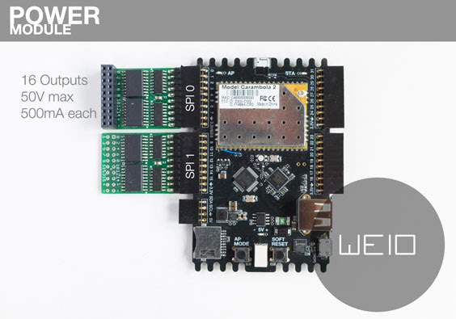

Board and HW
============

-This page should document board pin-out, explain HW interfaces, connections,
-give some examples how to do wiring and connect sensors, etc…

### WeIO

Some information about the WeIO board and hardware here.

### Power Module

Up to two power modules can be plugged into a WeIO board, offering 16 outputs for each module.
Each output can drive actuators consuming up to 50V and 500mA.

Connect the desired power supply to the +V and GND pins of the module.
Then connect each of the output pins to one pin (the + one if available) of each of your actuators, and the other pin of the actuator to the common GND of the module.

Notice that the module is a current amplifier, so it will work directly with motors, lamps or other « continuous » actuators, or relays.
In order to dim LEDs, it is necessary to create software PWM, or [BCM](http://www.batsocks.co.uk/readme/art_bcm_1.htm) or to use the PWM outputs of the WeIO (with an optional [Darlington array](http://be.farnell.com/fr-BE/stmicroelectronics/uln2803a/darlington-array-8npn-2803-dip18/dp/1094428) if required by the power consumption), or a SPI LED driver (such as [this one](http://be.farnell.com/fr-BE/texas-instruments/tlc5916in/ic-led-driver-8ch-pdip16/dp/1647814)), which are actually more appropriate techniques.

A good place to start using the powerModule is the powerModule example from the actuators folders. 

Technical description of the power module:
The Power Module is composed of two [8 bit shift registers](http://www.nxp.com/documents/data_sheet/74HC_HCT595.pdf) driving 2 [arrays of 8 Darlington transistors.](http://www.ti.com/lit/ds/symlink/uln2803a.pdf). See more on the [power module’s repository.](https://github.com/nodesign/weioPowerModule)